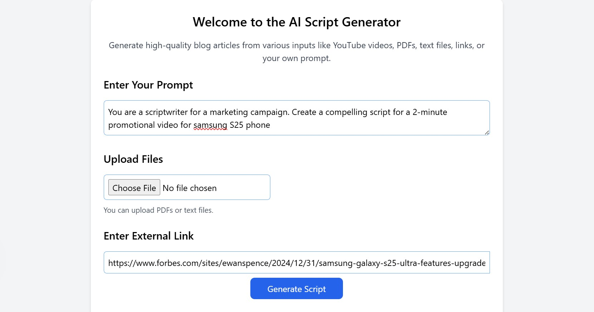
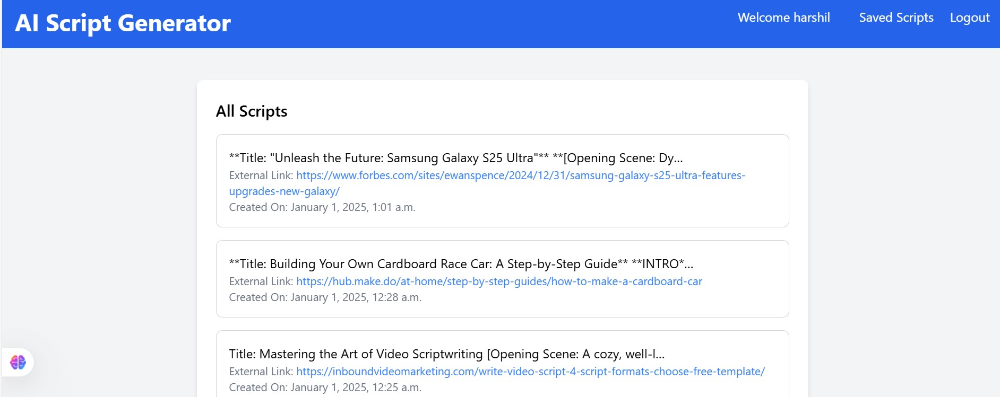
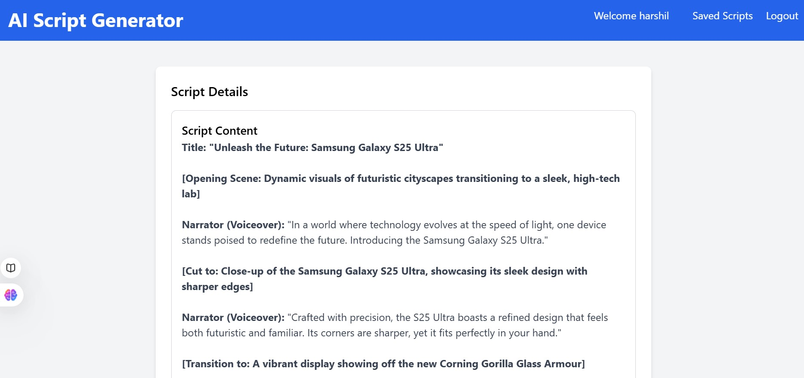

# Blog Content Generator

This project is a Django-based application that generates Scripts by leveraging X.AI's Grok-beta model. It accepts input through text prompts, external links, and uploaded files (PDF/TXT) to create comprehensive, well-structured scripts.

## Screenshots






## Features

- **Content Extraction**: 
  - Fetch content from external links, specifically from `h1` to `h6`, `p`, and `span` tags.
  - Extract text from uploaded files (PDF and TXT formats).
- **Blog Generation**: 
  - Generate blog content using X.AI's Grok-beta model.
  - Combine inputs from multiple sources (prompt, links, files) for enriched content.
- **Database Integration**:
  - Save generated content with metadata (external link, file name, etc.) in the database.
- **Error Handling**:
  - Handle invalid inputs, missing data, and file extraction errors gracefully.

## Installation

### Prerequisites
- Python 3.7+
- Django 4.0+
- X.AI API key
- Dependencies: Install using `pip install -r requirements.txt`

### Setup
1. Clone the repository:
   ```bash
   git clone https://github.com/Riyaansh-Mittal/AI-Script-Generator.git
   cd AI-Script-Generator
2. Create a virtual environment and activate it:
   ```bash
   python -m venv env
   source env/bin/activate  # On Windows use `env\Scripts\activate`
3. Install requirements:
   ```bash
   pip install -r requirements.txt
4. Apply migrations:
   ```bash
   python manage.py migrate
5. Start the Django server:
   ```bash
   python manage.py runserver
